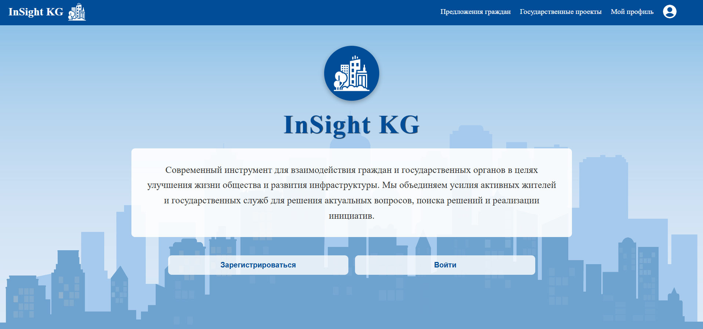

# Civic Initiatives Platform - InSight KG

## Описание

**InSight KG** — это современная платформа для взаимодействия граждан и государственных органов с целью улучшения качества жизни и развития инфраструктуры. Мы объединяем усилия активных граждан и государственных служб для решения актуальных проблем, поиска решений и реализации инициатив.

Проект предоставляет гражданам возможность предложить идеи и участвовать в государственных проектах, а также следить за развитием и прогрессом этих инициатив.

## Особенности

- **Предложения граждан:** Платформа позволяет пользователям предлагать инициативы, которые могут быть рассмотрены и реализованы государственными органами.
- **Государственные проекты:** Доступ к информации о текущих и будущих государственных проектах.
- **Профиль пользователя:** Пользователи могут создать и обновить свой профиль, а также отслеживать свою активность на платформе.
- **Интерактивность:** Возможность комментировать, поддерживать и оценивать инициативы и проекты.

## Технологии

- **Frontend:**
    - **Vue.js** — прогрессивный JavaScript-фреймворк для построения интерфейсов.
    - **Vue Router** — для маршрутизации между страницами.
    - **Vuex** — для управления состоянием приложения.
    - **SCSS** — для стилизации компонентов.
    - **Axios** — для выполнения HTTP-запросов.


### Основные компоненты:
- **Хэдер (HeaderComponent)**: Содержит название сайта, логотип и меню навигации.
- **Страницы приложения**:
    - **Предложения граждан**: Список инициатив граждан с фильтрацией.
    - **Государственные проекты**: Информация о текущих государственных проектах.
    - **Мой профиль**: Страница профиля пользователя.

## Скриншоты

### Главная страница

На главной странице отображается описание платформы, а также кнопки для регистрации и входа в систему.



### Предложения граждан

На странице с предложениями граждан пользователи могут просматривать и фильтровать предложения.


## Установка и запуск проекта

### Требования
- Node.js (рекомендуется версия 14.x или выше)
- npm или yarn

### Установка
1. Клонируйте репозиторий:
    ```bash
    git clone https://github.com/gubskaia/insight-kg.git
    cd digdevkgz2024
    ```

2. Установите зависимости:
    ```bash
    npm install
    # или
    yarn install
    ```

### Запуск проекта
Для локального запуска используйте команду:
```bash
npm run serve
# или
yarn serve
